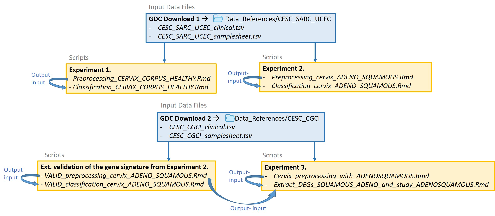

# MDPI_Journal_GENES_Uterine_Cancers-Characterization_through_Gene_Expression_Analysis

This repository collects the code used for the work "Uterine Cervix and Corpus Cancers Characterization through Gene Expression Analysis Using the KnowSeq Tool," prepared as a submission for GENES (MDPI Journal).

The folder "Data_References" contains the sample sheets from GDC (Genomics Data Portal) referencing the sample files used for this project, as well as clinical tables for the patients from whom the samples were taken. 

The project is divided into three experiments:

* Determination of a Gene Signature for the Characterization of Three Types of Uterine Tissues: Cervical Cancer, Uterine Corpus Cancer, and Healthy Uterine Tissue (Cervix/Corpus).

* Determination of a Gene Signature for the Characterization of the Two Main Histological Subtypes of Cervix Cancer: Adenocarcinoma and Squamous Cell Carcinoma.

* Study of Cervical Adenosquamous Carcinoma in Relation to the Two Main Histological Subtypes of Cervix Cancer.

The flowchart followed to analyze the input data with the scripts stored in this repository is as follows:

# Abstract
The analysis of gene expression quantification data is a powerful and widely used approach in cancer research. This project demonstrates its efficacy in identifying differentially expressed genes (DEGs) and accurately predicting uterine cancer types and histological subtypes. To achieve this, RNA-Seq data from the TCGA database were preprocessed and analyzed using the KnowSeq package. In the first experiment, a kNN model with a three-gene signature (VWCE, CLDN15, ADCYAP1R1) achieved consistent 100% test accuracy in predicting uterine cervix cancer, uterine corpus cancer and uterine healthy tissues, validated across 20 repetitions of a 5-fold cross-validation. In the second experiment, a kNN model with a uni-gene signature (ICA1L) consistently classified cervical cancer samples into adenocarcinoma and squamous cell carcinoma with 100% test accuracy, validated through 20 repetitions of a 5-fold cross-validation. In this case, the availability of the CGCI-HTMCP-CC project allowed for the external validation of the gene signature. Furthermore, an examination of six cervical adenosquamous carcinoma (mixed) samples revealed a pattern where the gene expression value in the mixed class aligned closer to the histological subtype with lower expression, prompting a reconsideration of the diagnosis for these mixed samples. In summary, this study provides valuable insights into the molecular mechanisms of uterine cervix and corpus cancers. The newly identified gene signatures demonstrate robust predictive capabilities, guiding future research in cancer diagnosis and treatment methodologies.

Department of Computer Engineering, Automatics and Robotics,University of Granada. C.I.T.I.C., Periodista Rafael Gómez Montero, 2, 18014. Granada, Spain.
luciaalmorox@correo.ugr.es
